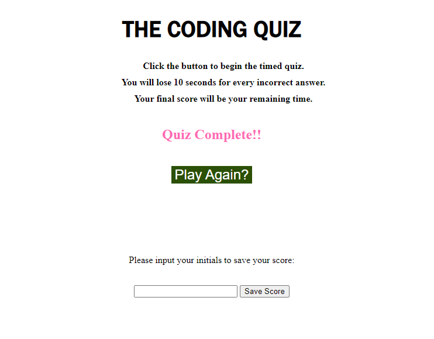
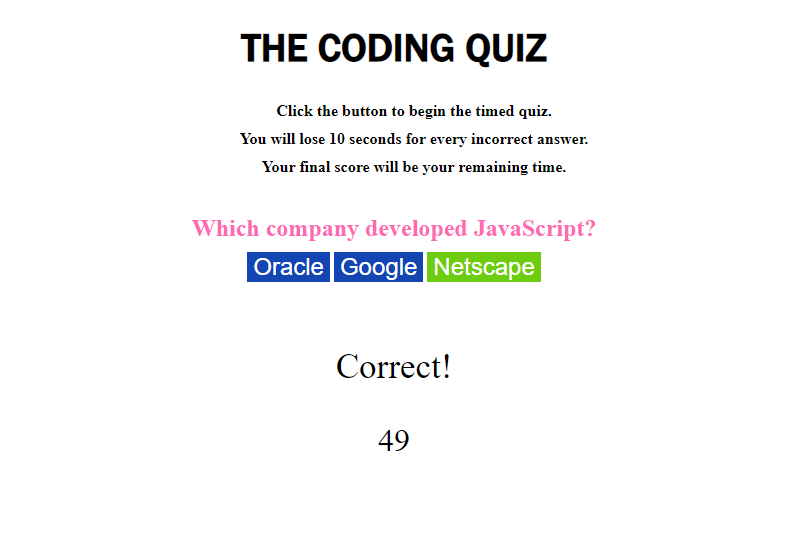

# The Coding Quiz
## Description
A JavaScript-powered timed quiz to test your JavaScript trivia!
Once the quiz begins you'll have 60 seconds to answer the questions as fast and accurately as possible!
Your final score will be how many seconds you have remaining on the clock after answering the final question!
Good Luck! 

## Built With
* Javascript
* HTML
* CSS

## Deployed Application
https://jpkashlak.github.io/the-coding-quiz/

## Preview

